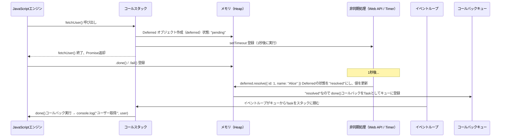

## 非同期処理の基本 (jQuery Deferred)

JavaScript の非同期を理解する記事の第 6 弾です。
前回は 非同期処理 + Callback 関数について紹介しました。非同期処理 + Callback 関数によって、JavaScript の非同期処理が書けるようになりましたが、実際の業務で使っていくと、不便な点が出てきます。その結果、より便利な形としてうまれたのが、jQuery の Deferred オブジェクトになります。本記事では、その誕生と JQuery Deferred の使い方を見ていこうと思います。

### そもそも jQuery とは何か

jQuery は 2006 年に 開発された JavaScript ライブラリです。当時はブラウザ間の互換性が現在より低く、ブラウザごとに異なるコードを書く必要がありました。そんな中、jQuery はクロスブラウザでの DOM 操作、イベント処理の簡素化を可能にするため作られました。jQuery は今でも、多くのプロジェクトにて使用されていますが、ブラウザの標準化や JavaScript 自体の進化, React などのフレームワークの台頭により、新規サービスで利用されることは少なくなってきています。

### 非同期処理 + Callback 関数による問題点

さて、前章で紹介した、非同期処理 + Callback 関数ですが、利用していくと大きな問題点が見えてきました。
例えば、3 つの 非同期処理 + Callback 関数を利用して、DB からデータを取得し、ログ記録して、メールを送信するという処理を実装したいとします。

```javascript
// 非同期処理 + Callback 関数を複数利用した非同期処理の例
getUser(userId, function (err, user) {
  if (err) {
    console.error("ユーザー取得失敗:", err);
    return;
  }
  logAccess(user, function (err) {
    if (err) {
      console.error("ログ記録失敗:", err);
      return;
    }
    sendEmail(user.email, function (err) {
      if (err) {
        console.error("メール送信失敗:", err);
        return;
      }

      console.log("全処理完了");
    });
  });
});
```

このコードはいわゆる、Callback 地獄問題と呼ばれる問題を抱えています。

1. 非同期処理の結果は呼び出し元のローカル変数に格納できないため、呼び出した結果を再利用する場合は global 変数などに格納する必要があります。しかし実行順や実行完了タイミングを管理できないため、状態管理が困難になります。結果として非同期処理を組み合わせる場合はネストとして書くことになり、処理全体の可読性や再利用性が低くなります。
2. エラー処理を個別に行うため、DRY 原則の適用が困難になります。

1 についてはよく言われていますが、2 についてはあまり言及されていないように思います。
これまで見たように、非同期処理は内部的には、別の Task として、登録、実行されます。そのため、呼び出し元の実行処理とは、切り離されており、Callback 関数内のエラー処理を、呼び出し元まで伝播させることができません。そのため、エラー処理は非同期関数内で直接行う必要があります。

以下はエラー処理の例です。

```javascript
// 同期エラーの捕捉
try {
  throw new Error("同期エラー");
} catch (e) {
  console.log("捕捉:", e.message);
}
// 非同期エラーの捕捉ができない
try {
  setTimeout(() => {
    throw new Error("非同期エラー");
  }, 0);
} catch (e) {
  console.log("捕捉:", e.message);
}
// 非同期エラーを個別ハンドリング
setTimeout(() => {
  try {
    throw new Error("非同期エラー");
  } catch (e) {
    console.log("個別の捕捉:", e.message);
  }
}, 0);
```

上記を実行すると、2 番目の例では呼び出し元でエラーを捕捉できず、Error としてコンソールに出力されます。これは、非同期処理が、キューに別タスクとして登録されているため、呼び出し元のコードとは切り離されているためです。
そのため、エラーは非同期関数内部にて捕捉する必要があります。結果として都度エラーハンドリングしなければならず、非同期処理 + Callback 関数はとても複雑で読みにくいコードになってしまいます。

### jQuery Deferred

#### Deferred の誕生

そんな中、2009 年に jQuery 1.5 がリリースされ、Deferred オブジェクトが導入されました。
Deferred オブジェクトは、すでに存在していた、"future / promise" といった概念を、JavaScript にて利用できるようにしました。
jQuery はライブラリのため、JavaScript 自体の内部処理は変わっていません。しかし上記の非同期処理を、より扱いやすくする、というのが Deferred オブジェクトの役割です。

#### Deferred になってできるようになったこと

Deferred オブジェクトを使うことで、非同期処理 + Callback 関数でできなかった、非同期処理のステータスと処理結果を管理することができます。
このため、ある非同期処理の結果を次の非同期処理に渡したり、非同期処理の結果ステータスを元に次の非同期処理を実行する、といったことを簡単にできるようになりました。

| 問題点           | Callback                     | Deferred の解決策                    |
| ---------------- | ---------------------------- | ------------------------------------ |
| 処理のネスト     | 深くネスト                   | `.then()` による直線的なチェーン     |
| エラー処理の分散 | 各コールバック内で try/catch | `.fail()` による集中的なハンドリング |
| 状態管理の困難さ | 値の受け渡しが煩雑           | Deferred オブジェクトによる状態保持  |

他にも便利なメソッドがたくさんありますが、ここでは割愛します。

実際に、上述した非同期処理のチェーンを Deferred を使って実装してみます。

```javascript
// Deferred による非同期チェーン
getUserAsync(userId)
  .then(function (user) {
    return logAccessAsync(user);
  })
  .then(function (user) {
    return sendEmailAsync(user.email);
  })
  .then(function () {
    console.log("全処理完了");
  })
  .fail(function (err) {
    console.error("処理失敗:", err);
  });
```

Callback 地獄の例と比較すると、Deferred を使うことで、処理のネストが深くなっていません。
前段階の関数の結果を次の関数に渡すことができます。
また、エラー処理も 最後の `.fail()` によって、集中的に行うことができます。

#### Deferred の内部的な処理

上述したように、Deferred オブジェクトは、非同期処理のステータスと結果を管理することができます。

```javascript
// Deferred の内部処理を理解するためのコード
import $ from "jquery";

function fetchUser() {
  const deferred = $.Deferred();

  setTimeout(() => {
    // 非同期処理完了 id:1, name:Alice を返す
    deferred.resolve({ id: 1, name: "Alice" });
  }, 1000);
  return deferred.promise();
}

fetchUser()
  // 非同期処理の結果を受け取る
  .done((user) => {
    console.log("ユーザー取得:", user);
  })
  .fail((err) => {
    console.error("エラー:", err);
  });
```

内部的には、以下のような流れで処理が行われています。
Deferred は、非同期処理の結果を管理するオブジェクトであるため、それ自体が何かの処理を行うわけではありません。
自身が管理する状態に応じて、`done()` や `fail()` メソッドを呼び出す役割を持ちます。



#### Deferred の使い方詳細

さて、JQuery Deferred についてですが、以下のブログにて非常にわかりやすく解説されているためこちらを読んで見てください。自分も非常に参考にさせていただきました。
[爆速でわかる jQuery.Deferred 超入門](https://techblog.yahoo.co.jp/programming/jquery-deferred/)

基本的には上記の記事をありがたく読ませてもらうのが良いと思いますが、一点補足するとすれば jQuery 3.0 にて、Deferred オブジェクトが Promise と互換性を持つようになりました。[ソース](https://blog.jquery.com/2016/06/09/jquery-3-0-final-released/)
そのため、jQuery 3.0 以降を利用している場合は、`then()` の振る舞いが変わっており、JavaScript の `Promise` と同じように利用することが可能ということに注意が必要です。

### コードを実行してみよう

**JQuery Deferred による非同期処理の値の受け渡し**

```javascript
// 非同期処理の値の受け渡し
import $ from "jquery";

function getUser() {
  const d = $.Deferred();

  setTimeout(() => {
    d.resolve({ id: 1, name: "Alice" });
  }, 500);

  return d.promise();
}

getUser().done((user) => {
  console.log("ユーザー取得:", user.name);
});
```

**JQuery Deferred による非同期処理のステータスの管理**

```javascript
// 非同期処理のステータスの管理
import $ from "jquery";

function fetchDataWithStatusCheck() {
  const deferred = $.Deferred();

  console.log("初期状態:", deferred.state()); // pending

  setTimeout(() => {
    const success = Math.random() > 0.5;
    console.log("success?", success);

    if (success) {
      deferred.resolve("データ取得成功");
    } else {
      deferred.reject("データ取得失敗");
    }

    console.log("完了後の状態:", deferred.state()); // resolved or rejected
  }, 500);

  return deferred;
}

const dfd = fetchDataWithStatusCheck();

setTimeout(() => {
  console.log("300ms 時点での状態:", dfd.state()); // まだ pending の可能性あり
}, 300);

dfd
  .done((msg) => {
    console.log("成功:", msg);
  })
  .fail((err) => {
    console.log("失敗:", err);
  });
```

**JQuery Deferred による非同期処理の並列実行**

```javascript
// 非同期処理の並列実行
import $ from "jquery";

function task(name, delay) {
  const d = $.Deferred();
  setTimeout(() => {
    console.log(name + " 完了");
    d.resolve(name);
  }, delay);
  return d.promise();
}

$.when(task("Task1", 500), task("Task2", 3000)).done((res1, res2) => {
  console.log("全タスク完了:", res1, res2);
});
```

**JQuery Deferred と Promise の互換性 (jQuery 3.0 以降)**

```javascript
// jQuery 3.0 以降なら async/await で扱える
import $ from "jquery";

function asyncOperation() {
  const d = $.Deferred();
  setTimeout(() => {
    d.resolve("Success!");
  }, 300);
  return d.promise();
}

(async function () {
  try {
    const result = await asyncOperation();
    console.log("await 結果:", result);
  } catch (err) {
    console.log("エラー:", err);
  }
})();
```

## まとめ

この記事では、jQuery Deferred について理解しました。Deferred は非同期処理を扱うのに非常に便利なオブジェクトであり、現在の JavaScript の Promise の前身とも言えるものだと思います。現在は、JavaScript の機能が拡充され、jQuery を使わずとも非同期処理を楽に扱うことができるため、jQuery を利用する機会というのはあまりないかもしれません。しかし、その仕組みを理解することは、JavaScript の非同期処理を理解する上で重要なことだと思います。

さて、今回は jQuery について以下を学びました。

- jQuery Deferred の概念
- jQuery Deferred の基本的な使い方
- jQuery 3.0 以降での Deferred の変更点

### 次回

この記事では jQuery Deferred について解説しました。ここまでは `Callback`, `jQuery Deferred`とレガシーな非同期処理のパターンを見てきました。
次回はついに、JavaScript Promise (async/await) について見ていこうと思います。Deferred の誕生から数年後、　 JavaScript 自体に非同期処理のパターンが追加されます。第 7 章は **「Promise と async/await」** です。

この記事は、JavaScript について勉強した内容をまとめたものであり、内容が不正確な可能性があります。もし指摘などあれば、コメントいただけるととても嬉しいです。

### 参考資料

[爆速でわかる jQuery.Deferred 超入門](https://techblog.yahoo.co.jp/programming/jquery-deferred/)
[jQuery Deferred オブジェクト](https://api.jquery.com/category/deferred-object/)
[Futures and Promises (Wikipedia)](https://en.wikipedia.org/wiki/Futures_and_promises)
